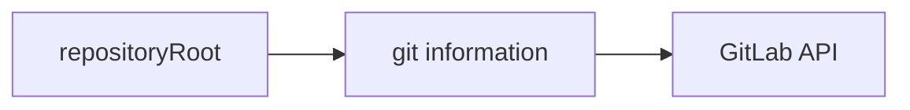
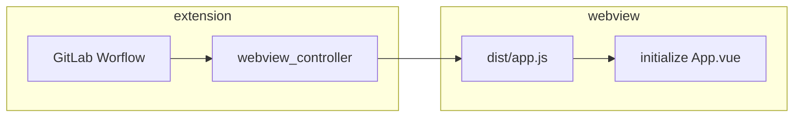

# Extension architecture

This document will give you a high-level overview of the main components of the extension. It will help you place your contribution in the right place within the codebase. This document describes the architecture as-is, but it also contains checkboxes for aspirations or refactoring in progress.

## What does the extension do?

The extension is providing a "glue" layer between the [VS Code Extension API](https://code.visualstudio.com/api/references/vscode-api) and the GitLab instance API ([REST], [GraphQL]). The extension code aims to connect VS Code editor with GitLab functionality as efficiently as possible. The less code and abstractions, the better.

## The key concept

Every action in the extension needs to know the `repositoryRoot`. `repositoryRoot` is the local filesystem path to a git repository open in VS Code editor.

We get the GitLab instance URL, project namespace and branch information from the Git repository. We use this information to make queries to the GitLab API.

### Git integration

The extension uses [`git_extension_wrapper.ts`](../src/git/git_extension_wrapper.ts) to connect to the VS Code Git Extension and read information about repositories. Each repository in the open workspaces is [wrapped](../src/git/wrapped_repository.ts) and used throughout the rest of the extension as a base for executing git commands.

[`git_service.ts`](../src/git_service.ts) currently handles all `git` access. This service takes a repository root folder and provides us with information about the `git` repository.

- [ ] The VS Code editor works with git through its built-in [`git` extension](https://github.com/microsoft/vscode/tree/main/extensions/git). We want to use this extension instead of our custom `git_service` ([#203](https://gitlab.com/gitlab-org/gitlab-vscode-extension/-/issues/203))[^1].

### GitLab integration

We've got two modules that connect to the GitLab API:

- [`gitlab_service.ts`](../src/gitlab/gitlab_service.ts) - New features get implemented here. We try to use predominantly [GraphQL], but some features are not available in [GraphQL], and then we use `node-fetch` to connect to the [REST] API. `gitlab_service.ts` is not dependent on `git`. You should place the code that combines `git` with GitLab API one level higher (in commands or other code).

## Building blocks of the extension

### Side bar (`src/data_providers`)

Side bar, also called [TreeView](https://code.visualstudio.com/api/extension-capabilities/extending-workbench#tree-view), is the left-hand-side panel where we show issues and merge requests. Every VS Code extension can contribute a TreeView.

### Commands (`src/commands`)

[Commands](https://code.visualstudio.com/api/extension-guides/command) are functions that can be invoked either by the user (usually from [command palette](https://code.visualstudio.com/docs/getstarted/userinterface#_command-palette)) or programmatically. Example commands in this extension would be: "Paste snippet", "Refresh sidebar", and "Copy link to active file on GitLab".

Commands are usually a function without input. They read the state from VS Code editor, Git repository, contact GitLab API and either open the GitLab website or change the UI in VS Code.

- [ ] Move commands from `src/openers.js` to `src/commands` folder.

### Status bar (`src/status_bar.js`)

The status bar is the last row at the bottom of the editor. We add multiple [Status Bar Items](https://code.visualstudio.com/api/extension-capabilities/extending-workbench#status-bar-item) to it to show pipeline status, open MR and closing Issue for the current branch.

We also periodically check for changes (30 seconds for a pipeline, 60 seconds for MR and Issue). The code of `status_bar.js` is very tricky, with a plethora of side effects. Proceed with caution and add unit tests before you change logic.

- [ ] Status bar issues are labelled [`~status-bar`](https://gitlab.com/gitlab-org/gitlab-vscode-extension/-/issues?label_name=status-bar)
- [ ] when we use the built-in git extension in VS Code, we should [react when the user changes branch and fetch new information](https://gitlab.com/gitlab-org/gitlab-vscode-extension/-/issues/21)

### Webview (`src/webview/`)

[Webview](https://code.visualstudio.com/api/extension-guides/webview) is an API that allows extensions to put custom web page into an editor tab.

We use webview to show MR and Issue details. We use a separate npm module with its tests and build system (webpack, babel). This npm module contains a Vue app that gets compiled into dist js files. `src/webview_controller.js` is placed in the extension project and initializes the whole webview.

To further understand how the extension communicates with the webview, read the [Webview extension guide](https://code.visualstudio.com/api/extension-guides/webview).

### Access tokens (`src/services/token_service.ts`)

We authenticate to GitLab API using [personal access tokens](https://docs.gitlab.com/ee/api/README.html#personalproject-access-tokens). These tokens are stored in [`ExtensionContext.globalState`](https://code.visualstudio.com/api/references/vscode-api#ExtensionContext.globalState). [`TokenService`](../src/services/token_service.ts) orchestrates storing and retrieving tokens.

---

Introducing this document was motivated by a blog article from Aleksey Kladov: [ARCHITECTURE.md](https://matklad.github.io//2021/02/06/ARCHITECTURE.md.html).

[REST]: https://docs.gitlab.com/ee/api/api_resources.html
[GraphQL]: https://docs.gitlab.com/ee/api/graphql/

[^1]:  This will help keep the `git` information between VS Code and the GitLab extension in sync. The status bar will benefit the most because it currently [gets out of sync when the user switches to a different branch](https://gitlab.com/gitlab-org/gitlab-vscode-extension/-/issues/21).
