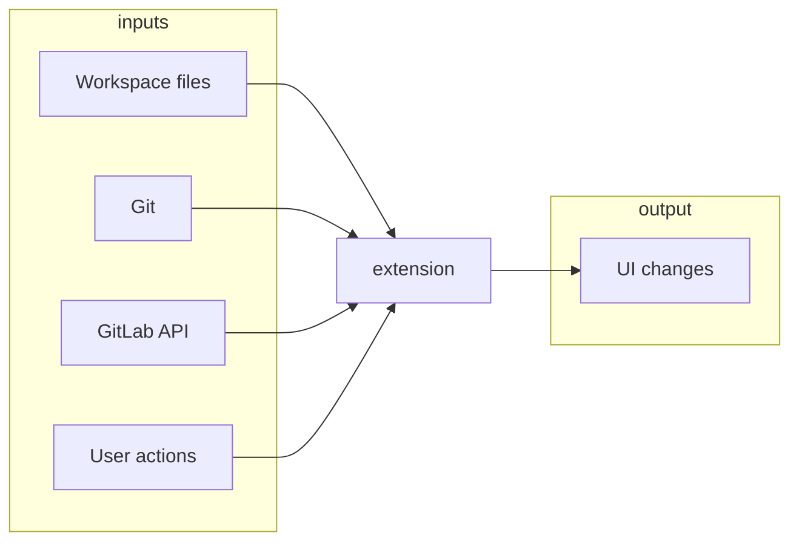
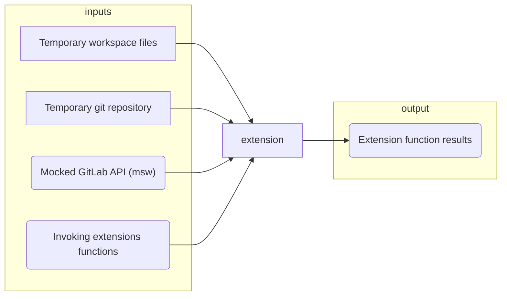
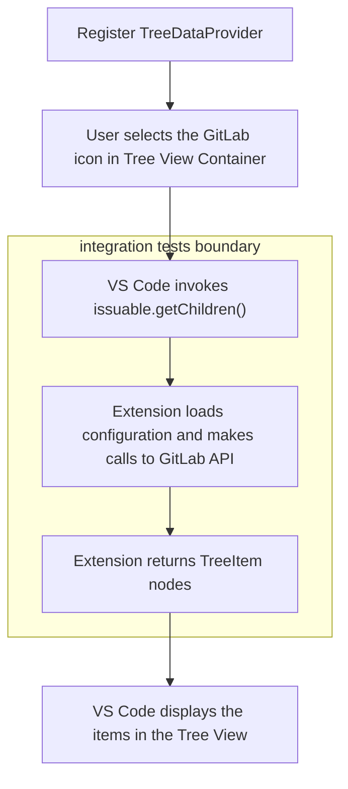

# Automated testing strategy

This document explains what the extension does, defines requirements for the automated test suite, draws a distinction between unit, integration and E2E tests, and defines what tests we write.

For practical information on writing tests for this extension, see [Writing tests](writing-tests.md).

## What the extension does

The best way to see the extension's features is to read through the [`README.md`](../README.md).

To understand the codebase architecture, please look at [`architecture.md`](architecture.md).

## Requirements for the automated test suite

The requirements are in order of importance:

1. Prevent regression
1. Verify the new code is working
1. Enable easy refactoring

(*See [Sarah Mei - Five Factor Testing](https://madeintandem.com/blog/five-factor-testing/) for more details on test requirements.*)

## What does testing look like in VS Code

When looking at the tests from the perspective of the testing pyramid[^1], the VS Code ecosystem offers two levels of granularity.

### Unit tests

Unit tests (written in Jest) are run directly in the development environment, and they are not dependent on the VS Code editor and its APIs. We need to mock all the parts of the `vscode` module API that we use. The `vscode` module is not available at all for unit tests.

### Integration tests

We write integration tests in `mocha`. They run within a VS Code instance. These tests have access to a full [`vscode` VS Code API](https://code.visualstudio.com/api/references/vscode-api). They can use this API to prepare the editor's state for running the tests.

These are the only tests that can use the implementation of `vscode` module. Because this module is [not installed through npm](https://gitlab.com/gitlab-org/gitlab-vscode-extension/-/blob/7bd63cafb794e565dce30005a06ea9d073740388/package.json#L519-524) and it's only available to the extension as a runtime dependency.

Integration tests in VS Code act as another extension that can manipulate the editor. They can require any module from our extension, run it, and validate the output.

The integration tests **can't** [validate how UI looks or simulate user clicking](#quick-side-note-on-missing-e2e-tests).

The next sections will explain:

- how the VS Code Extension integrates with the editor and outside world
- how we can replace/mock these real integration points to achieve the most realistic test environment

#### Extension in production

The extension reads Git repository status using `git` binary. It reads files from the project workspace, communicates with the GitLab API using `request-promise` or `node-fetch`, and it receives input from the user in the form of commands and clicks on components. The user sees the output displayed in the editor.

#### Extension under integration tests

*Legend: Round corners mean that the test doesn't match production use exactly.*

##### Temporary git repository and workspace files

When we start integration tests, we create a temporary folder and initialize a git repository in it. This workspace is no different from any other vscode workspace. The tests provide a high level of confidence that the git/workspace integration will work well in production.

##### Mocked GitLab API (msw)

We'll use [`msw`](https://mswjs.io/docs/) to intercept all HTTP(S) requests during testing, and we'll return mocked responses.

##### Testing extension functions

To avoid more complex and flakey UI testing by simulating user clicks and inspecting the DOM, we will test the extension at the **VS Code API boundary**. The following example explains the testing boundary on the [TreeView](https://code.visualstudio.com/api/extension-guides/tree-view) functionality. (See [Workbench documentation](https://code.visualstudio.com/api/extension-capabilities/extending-workbench) to understand the VS Code-specific terms.)

We are making a trade-off. Because we don't access the extension through the `extension.js`.`activate()` entry function, we'll have less confidence in the extension setup. After changing the configuration (e.g. the way we register commands), we'll have to test the change manually. In return, we get much simpler, reliable, and faster testing.

### Quick side note on missing E2E tests

The integration tests provide broad coverage of the functionality, and the preferred decision is to end our testing at the integration level. But the integration tests are not giving us confidence in two areas:

#### The extension functionality is correctly "plugged in" to VS Code

**A simple example**: We can have a well-implemented and tested command, but we didn't register it in the editor. All tests will pass, but the user can't use the command.

VS Code project itself does have [a few smoke tests](https://github.com/microsoft/vscode/tree/c1f44f4e3e6410b53b74de904562cd507b96aa8c/test/smoke/src/areas) using their custom [driver](https://github.com/microsoft/vscode/blob/c1f44f4e3e6410b53b74de904562cd507b96aa8c/src/vs/platform/driver/node/driver.ts) for interacting with the editor.

If we find that we release bugs caused by incorrect extension configuration, we might implement a few smoke tests and use the node or chrome driver to run tests simulating the user behaviour.

#### Tests don't call real GitLab API

Using a real GitLab instance would have major disadvantages:

- If we set up an E2E test project on gitlab.com, we could run E2E tests in the CI. Communication with the gitlab.com instance would require a real access token, and so contributors without maintainer access wouldn't be able to run the E2E tests suite.
- The external dependency would severely increase testing time and decrease reliability thanks to network communication.

## What tests are we going to write

The extension doesn't contain much business logic that would warrant extensive unit testing. It mainly integrates the editor with GitLab API. The codebase is also relatively small (~50 production files), which means that the test speed will not be an issue at any granularity.

This document suggests making the vast majority of tests integration tests based on the [automated testing requirements](#requirements-for-the-automated-test-suite). Integration tests are going to provide the most confidence in the extension working as expected[^1]. They will test more code with fewer tests, and they shouldn't change much as we refactor the extension because they don't test the inner units of the extension. The easier refactoring might come in handy if we [replace some libraries](https://gitlab.com/gitlab-org/gitlab-vscode-extension/-/merge_requests/54).

### Drawbacks of using integration tests

The main drawback is the error specificity. Especially since we [don't have a good error logging](https://gitlab.com/gitlab-org/gitlab-vscode-extension/-/issues/145), when the test fails, we often end up with just "the integration test result is not as expected" error. That can be frustrating and will only improve with better error handling. Till then, we will often have to result in [debugging](writing-tests.md#debugging-integration-tests). Luckily the debugging of VS Code integration tests is quite easy.

Another drawback is the learning curve for contributors. The VS Code ecosystem doesn't have established testing practices, and most of the extensions are not tested at all[^3]. We can expect that it's going to be hard for contributors to write new types of tests.

## Manual testing

When implementing a new feature or a fix, the author of the change must manually test the change (if the test coverage is good, then only the happy path will suffice).

[^1]: [Alexey Golub - Unit Testing is Overrated](https://tyrrrz.me/blog/unit-testing-is-overrated)
[^2]: [Ham Vocke - Practical Testing Pyramid](https://martinfowler.com/articles/practical-test-pyramid.html)
[^3]: For example: [GitLens](https://github.com/eamodio/vscode-gitlens), [GitHub unofficial extension](https://marketplace.visualstudio.com/items?itemName=KnisterPeter.vscode-github), [VS Code ESLint extension](https://github.com/Microsoft/vscode-eslint)
