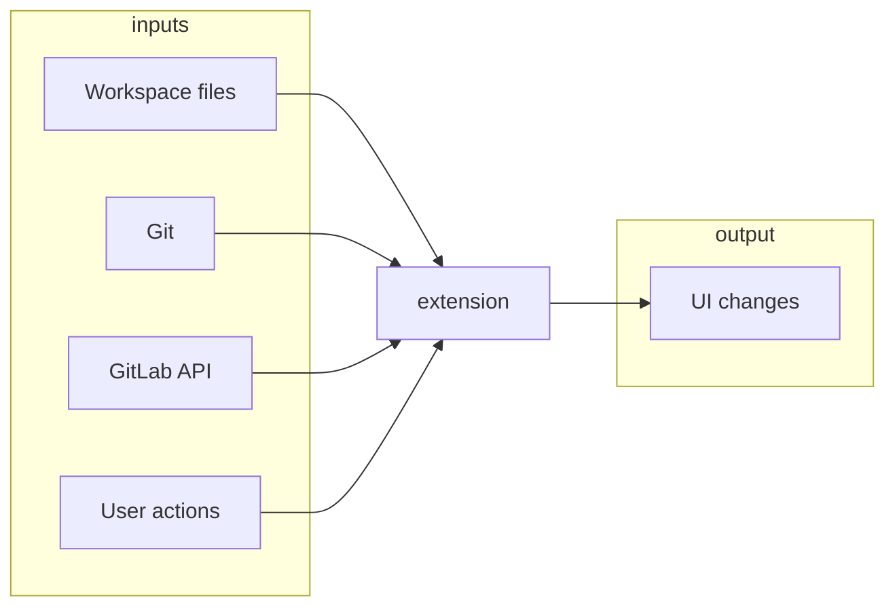
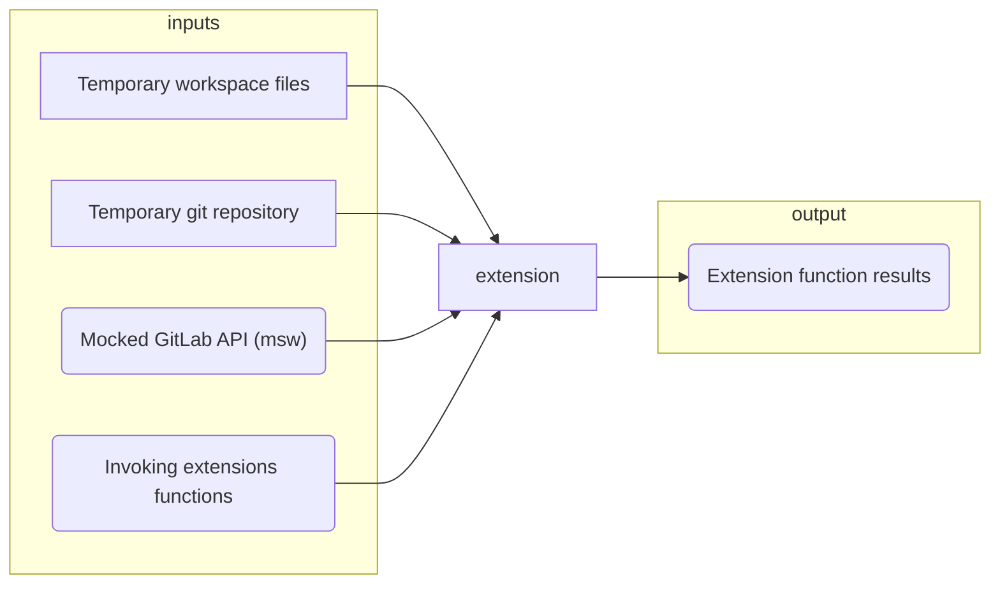
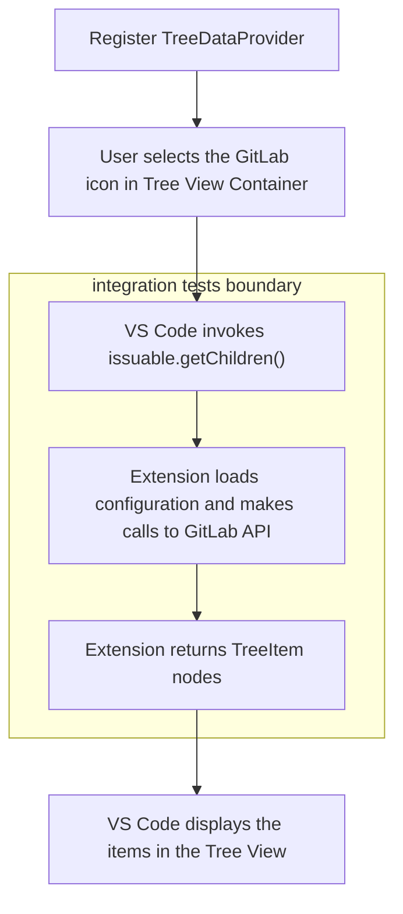

# Automated testing strategy

This document explains what the extension does, defines requirements for the automated test suite, draws a distinction between unit, integration and E2E tests, and defines what tests are we going to write.

For practical information on how to write tests for this extension, see [Writing tests](writing-tests.md).

## What the extension does

The extension's primary goal is to provide the rich GitLab functionality closer to the place where engineers spend a large portion of their time, the editor. The extension integrates the VS Code editor with a GitLab instance. It does that in four main categories.

- Surfaces project issues and merge requests in the [Tree View](https://code.visualstudio.com/api/extension-capabilities/extending-workbench#tree-view) (file explorer on the left)
- Provides an overview for the current branch in the [status bar](https://code.visualstudio.com/api/extension-capabilities/extending-workbench#status-bar-item) - the running pipeline, the associated merge request and the closing issue
- Shows issues and merge request directly in the extension using a [WebView](https://code.visualstudio.com/api/extension-capabilities/extending-workbench#webview)
- Provide a large number of [commands](https://code.visualstudio.com/api/extension-capabilities/common-capabilities#command) that are creating snippets, opening the GitLab website on different pages, validating the `.gitlab_ci.yml` file and more.

## Requirements for the automated test suite

We do have confidence that the current code works because it runs in production for months and most of the outstanding issues are now tracked as [open issues](https://gitlab.com/gitlab-org/gitlab-vscode-extension/-/issues). So the test suite doesn't have to focus on verification as much as on preventing regression.

At the same time, the tests need to enable easy refactoring since the codebase is going to undergo significant changes soon (e.g. TypeScript migration).

The requirements are then in order of importance:

1. Prevent regression
1. Enable easy refactoring

(*See [Sarah Mei - Five Factor Testing](https://madeintandem.com/blog/five-factor-testing/) for more details on test requirements.*)

## How does testing look in VS Code

When looking at the tests from the perspective of the testing pyramid[^1], the VS Code ecosystem offers two levels of granularity.

### Unit tests

Unit tests (written in Jest) are run directly in the development environment, and they are not dependent on the VS Code editor and its APIs. The tests will fail to execute if they import any code dependent on the `vscode` module.

### Integration tests

These tests are written in `mocha` as well, but they are running within a VS Code instance. These tests have access to a full [VS Code API](https://code.visualstudio.com/api/references/vscode-api). They can use this API to prepare the editor's state for running the tests.

These are the only tests that can run code dependent on the `vscode` module. Because this module is [not installed through npm](https://gitlab.com/gitlab-org/gitlab-vscode-extension/-/blob/7bd63cafb794e565dce30005a06ea9d073740388/package.json#L519-524) and it's only available to the extension as a runtime dependency.

Integration tests in VS Code act as another extension that can manipulate the editor. They can require any module from our extension run it and validate the output.

What the integration tests **can't do** is to [validate how UI looks or simulate user clicking](#quick-side-note-on-missing-e2e-tests).

Now we'll see how the VS Code Extension integrates with the editor and outside world. Then we'll have a look at how we can replace/mock these real integration points to achieve the most realistic test environment.

#### Extension in production

The extension reads Git repository status using `git` binary, it reads files from the project workspace, it communicates with the GitLab API using `request-promise`, and it receives input from user in the form of commands and clicks on components. The user sees the output displayed in the editor.

#### Extension under integration tests

*Legend: Round corners mean that the test doesn't match production use exactly.*

##### Temporary git repository and workspace files

When we start integration tests, we create a temporary folder and initialize a git repository in it. This workspace is no different from any other vscode workspace. The tests provide a high level of confidence that the git/workspace integration will work well in production.

##### Mocked GitLab API (msw)

We'll use [`msw`](https://mswjs.io/docs/) to intercept all HTTP(S) requests during testing, and we'll return mocked responses.

##### Testing extension functions

To avoid more complex and flakey UI testing with simulating user clicks and inspecting the DOM, we are going to test the extension at the VS Code API boundary. The following example explains the testing boundary on the [TreeView](https://code.visualstudio.com/api/extension-guides/tree-view) functionality. (See [Workbench documentation](https://code.visualstudio.com/api/extension-capabilities/extending-workbench) to understand the VS Code-specific terms.)

We are making a trade-off. We'll have less confidence in the extension setup. After changing configuration (e.g. the way we register commands), we'll have to test the change manually. In return, we get much simpler, reliable, and faster testing.

### Quick side note on missing E2E tests

The integration tests provide broad coverage of the functionality, and the preferred decision is to end our testing at the integration level. But the integration tests are not giving us confidence in two areas.

#### The extension functionality is correctly "plugged in" to VS Code

 A simple example: We can have a well-implemented and tested command, but we didn't register it in the Editor. All tests will pass, but the user can't use the command.

VS Code project itself does have [a few smoke tests](https://github.com/microsoft/vscode/tree/c1f44f4e3e6410b53b74de904562cd507b96aa8c/test/smoke/src/areas) using their custom [driver](https://github.com/microsoft/vscode/blob/c1f44f4e3e6410b53b74de904562cd507b96aa8c/src/vs/platform/driver/node/driver.ts) for interacting with the editor.

If we find that we release bugs caused by incorrect extension configuration, we might implement a few smoke tests and use the node or chrome driver to run tests simulating the user behaviour.

#### Tests don't call real GitLab API

Using a real GitLab instance would have major disadvantages:

- If we set up an E2E test project on gitlab.com, we could run E2E tests in the CI. Communication with the gitlab.com instance would require a real access token, and so contributors without maintainer access wouldn't be able to run the E2E tests suite.
- The external dependency would severely increase testing time and decrease reliability thanks to network communication.

## What tests are we going to write

The extension doesn't contain much business logic that would warrant extensive unit testing. It mainly integrates the editor with GitLab API. The codebase is also quite small (~20 production files) which means that the test speed is not going to be an issue at any granularity.

Based on the [automated testing requirements](#requirements-for-the-automated-test-suite), this document suggests making the vast majority of tests integration tests. Integration tests are going to provide the most confidence in the extension working as expected[^1]. They are going to test more code with fewer tests, and they shouldn't change much as we refactor the extension, because they don't test inner units of the extension. The easier refactoring might come handy if we [replace some libraries](https://gitlab.com/gitlab-org/gitlab-vscode-extension/-/merge_requests/54).

### Drawbacks of using integration tests

The main drawback is the error specificity. Especially since we [don't have a good error logging](https://gitlab.com/gitlab-org/gitlab-vscode-extension/-/issues/145), when the test fails, we often end up with just "the integration test result is not as expected" error. That can be frustrating and will only improve with better error handling. Till then, we will often have to result to [debugging](writing-tests.md#debugging-integration-tests). Luckily the debugging of VS Code integration tests is quite easy.

Another drawback is the learning curve for contributors. The VS Code ecosystem doesn't have established testing practices and most of the extensions are not tested at all[^3]. We can expect that it's going to be hard for contributors to write new types of tests. The maintainers will have to create examples of different tests (commands, status bar, tree view) before we can expect contributors to write integration tests for their contributions.

## Manual testing

Until the automated test suite covers the area of extension that the contributor changes, the author of the change must manually test the feature they are changing/adding.

## Conclusion

This strategy is an intimal draft. Since we now only have integration tests for the Tree View, we might alter the strategy a bit when we add tests for status bar and commands. The `webview` is a completely separate project, and it might be enough to unit test it since it doesn't integrate with the `vscode` almost at all.

We neeed to create a mechanism for limiting side effects in the temporary workspace, but thanks to using `git` it should be as simple as running `git clean -fdx` and `git reset --hard`.

[^1]: [Alexey Golub - Unit Testing is Overrated](https://tyrrrz.me/blog/unit-testing-is-overrated)
[^2]: [Ham Vocke - Practical Testing Pyramid](https://martinfowler.com/articles/practical-test-pyramid.html)
[^3]: For example: [GitLens](https://github.com/eamodio/vscode-gitlens), [GitHub unofficial extension](https://marketplace.visualstudio.com/items?itemName=KnisterPeter.vscode-github), [VS Code ESLint extension](https://github.com/Microsoft/vscode-eslint)
